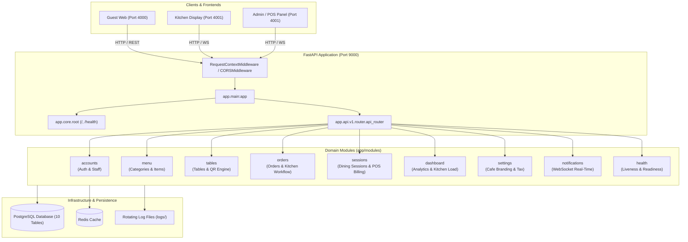

# System Architecture & Modular Design

## 1. Architectural Overview

The **Vaan Vibes Cafe & Restro Backend** has been consolidated into a high-performance, modular, domain-driven architecture following established enterprise standards (patterned directly after `/Users/mac/Desktop/ad-automation-be/master/app/modules/accounts`).

All legacy monolithic directories (`app/models/`, `app/schemas/`, `app/services/`, `app/routes/`, `app/websocket/`, `app/api/v1/endpoints/`) have been removed. Every business feature now lives entirely within its self-contained domain package under `app/modules/<module_name>/`.

### Core Design Principles Applied:
- **Separation of Concerns:** Business logic (`service.py`), data access (`crud.py`), models (`models.py`), request/response contracts (`schemas.py`), and HTTP routing (`apis.py`, `router.py`) are strictly partitioned per domain.
- **Pydantic v2 Native:** All models use native `model_config = ConfigDict(populate_by_name=True, from_attributes=True)` with zero deprecation warnings.
- **Zero Circular Dependencies:** Domain modules import inward from lower layers (`app.core`, `app.db`) and peer module models/schemas without circular references.
- **Unified Base Model Discovery:** All 10 SQLAlchemy tables are registered authoritatively through `app.db.base`, ensuring seamless Alembic migrations and database introspection.

---

## 2. Finalized Directory Structure

```
app/
├── api/
│   └── v1/
│       └── router.py           # Centralized API v1 router mounting all domain module routers
├── core/                       # Shared application infrastructure & cross-cutting concerns
│   ├── config.py               # Pydantic Settings & environment variables
│   ├── dependencies.py         # Authentication & RBAC dependency injectors
│   ├── exception_handlers.py   # Global exception handling & standardized JSON errors
│   ├── middleware.py           # Request-context & response standardizers
│   ├── root.py                 # Application root metadata (/) & root health check
│   ├── routers.py              # Application router registration pipeline
│   ├── security.py             # JWT token issuance, verification & hashing
│   └── setup_middleware.py     # Middleware registration pipeline
├── db/                         # Database connection, session management, and Base
│   ├── base.py                 # Central model registry importing all domain models
│   ├── session.py              # Engine, SessionLocal, and Declarative Base
│   └── seed.py                 # Database seeding routine
├── modules/                    # Self-contained business domain modules
│   ├── accounts/               # Auth, Admin & Chef staff management
│   │   ├── apis.py             # Route controller handlers
│   │   ├── crud.py             # Database query operations
│   │   ├── models.py           # User SQLAlchemy model
│   │   ├── router.py           # APIRouter(prefix="/auth")
│   │   ├── schemas.py          # LoginRequest, UserResponse, Chef schemas
│   │   ├── service.py          # AccountService (auth, bcrypt hashing)
│   │   └── __init__.py         # Clean domain exports
│   ├── dashboard/              # Analytics KPI metrics & kitchen display counts
│   ├── health/                 # Database, Redis & system health probes
│   ├── menu/                   # Food catalog, categories, pricing, and 86 availability
│   ├── notifications/          # WebSocket connection manager & real-time broadcasting
│   ├── orders/                 # Customer cart, order placement & kitchen state machine
│   ├── sessions/               # Dining sessions, table billing, POS ledger & receipts
│   ├── settings/               # Cafe brand metadata, GSTIN, and tax rates
│   └── tables/                 # Physical tables, QR code generation & guest scan redirects
├── main.py                     # ASGI application bootstrap
└── cli.py                      # Unified management CLI (createsuperuser, seed)
```

---

## 3. Project Structure Diagram


