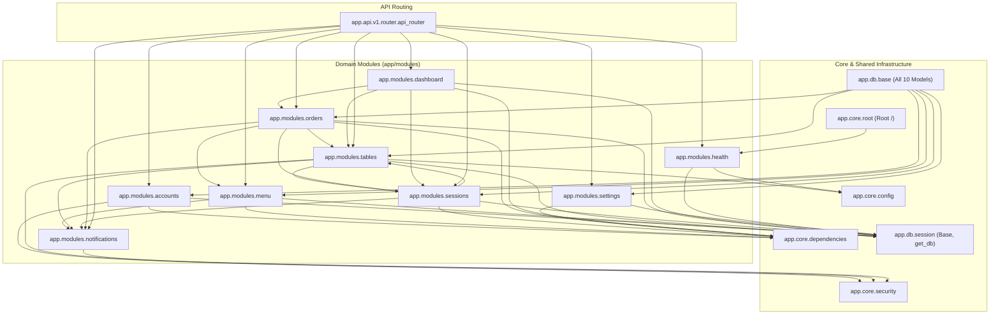

# Module Dependency Graph

## 1. Architectural Layers & Dependency Rules

Dependencies strictly follow a unidirectional hierarchy:
1. **Core / Infrastructure** (`app.core`, `app.db`): Zero domain dependencies.
2. **Domain Models & Schemas** (`app.modules.<domain>.models`, `app.modules.<domain>.schemas`): Only depend on Core & DB.
3. **Data Access (CRUD)** (`app.modules.<domain>.crud`): Depends on domain models and schemas.
4. **Domain Services** (`app.modules.<domain>.service`): Coordinate business rules and trigger cross-cutting domain notifications.
5. **API Presentation** (`app.modules.<domain>.apis`, `app.modules.<domain>.router`): Thin controller layer accepting HTTP requests, invoking services, and returning validated schemas.

---

## 2. Mermaid Module Dependency Diagram

