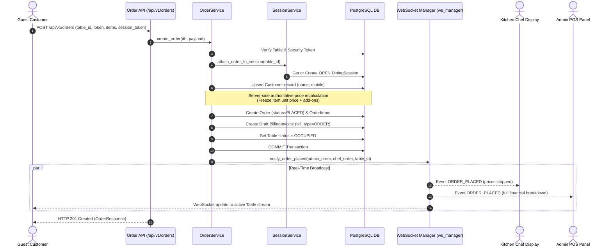
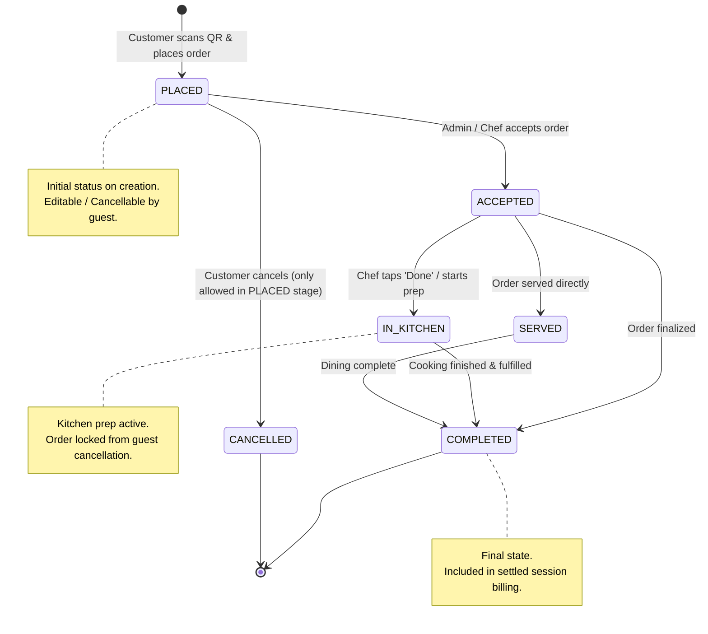
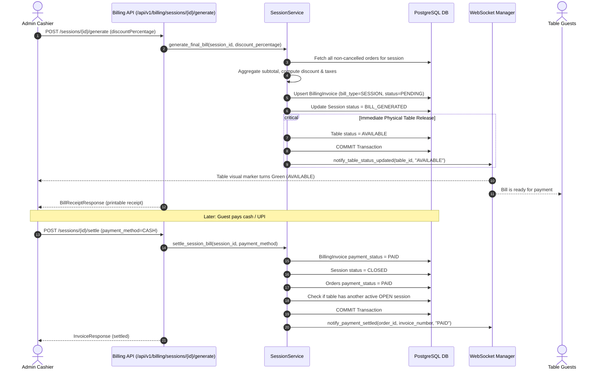

# System Execution Flows

## 1. Customer Order Placement & Authoritative Price Computation Flow

---

## 2. Order Lifecycle & Kitchen State Machine Flow

---

## 3. Dining Session Billing, Ledger & Immediate Table Release Flow

